## **Follow Video to practice simplest process**

[Youtube video 1 ~1:12](https://youtu.be/5uuF31oIg18)

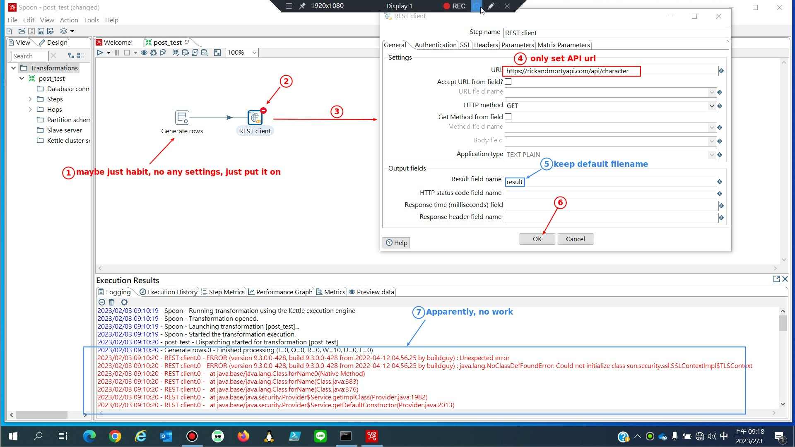

- Vincent said that is occurred by JDK version (now 19)

  - should change to JDK 18

## **Windows Environment TEST**

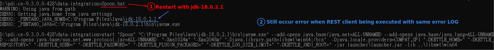

## **Ubuntu 22.04 Environment TEST**

### _change java-18-openjdk-amd64_

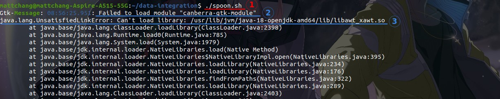

**fix for (1)**

- https://www.wongwonggoods.com/linux/linux-ubuntu/canberra-gtk-module/

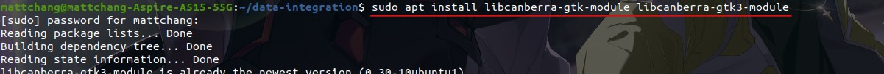

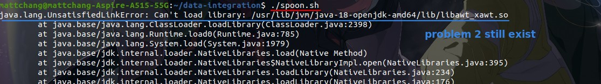

**fix for (2)**

- https://stackoverflow.com/questions/67391845/exception-java-lang-unsatisfiedlinkerror-when-trying-to-open-allure-reports-in-w

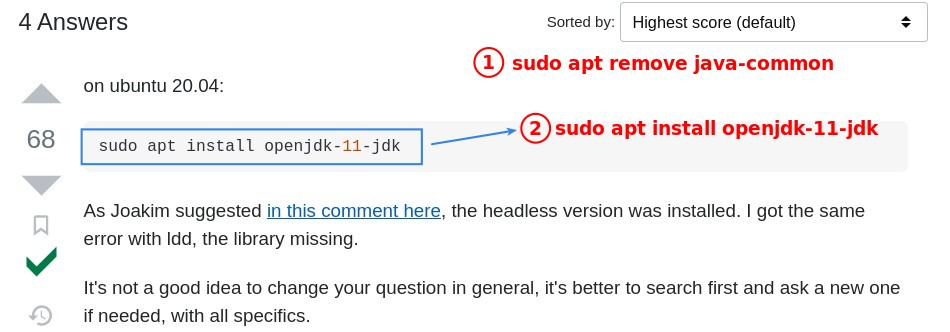

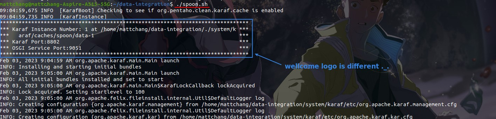

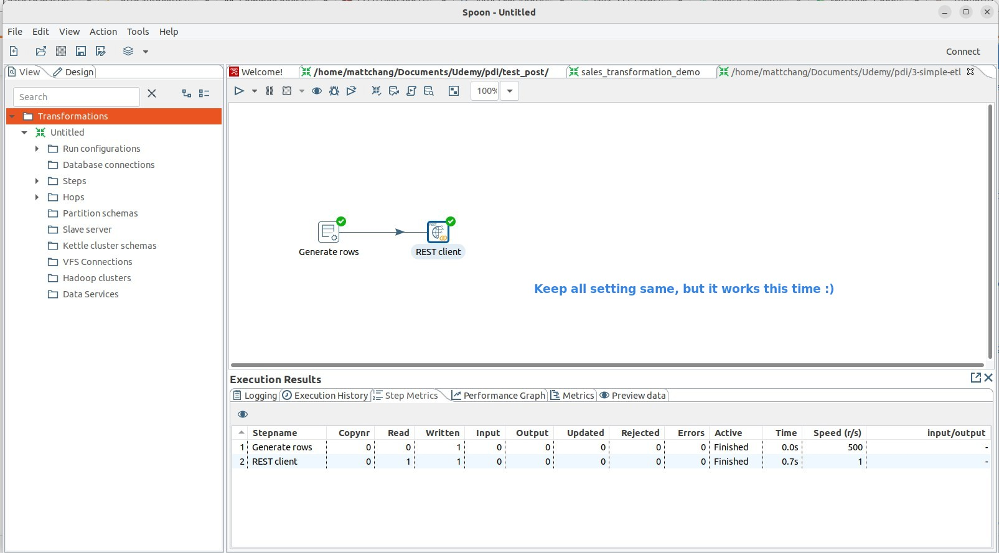

### _POST method TEST_

**Create node app for POST API**

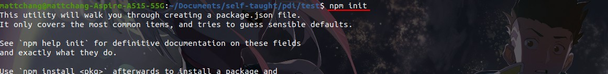

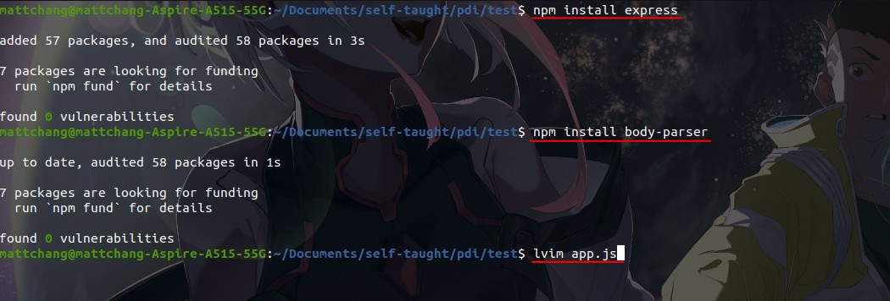

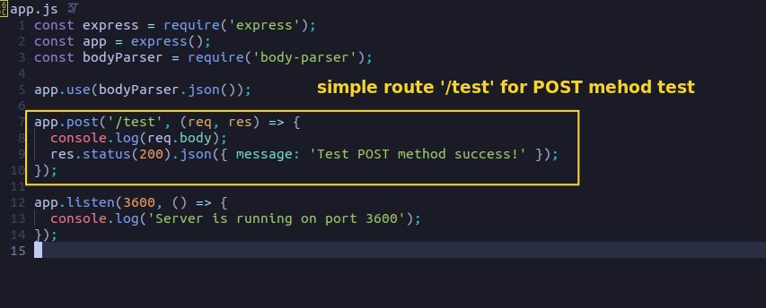

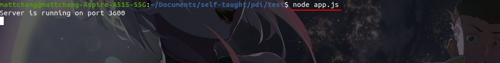

**Configuration of PDI**

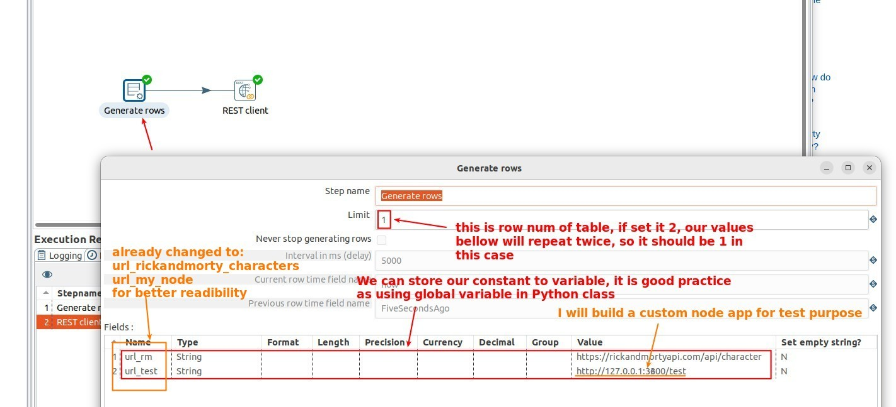

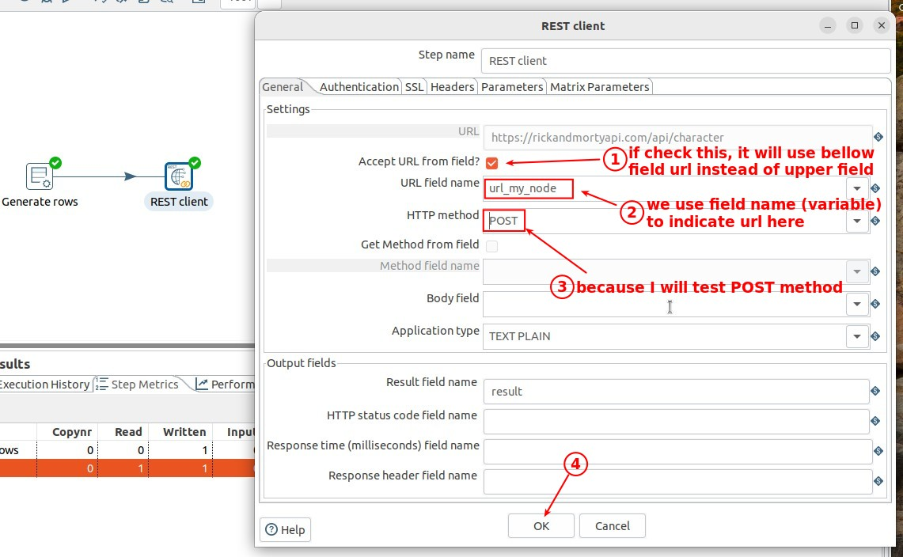

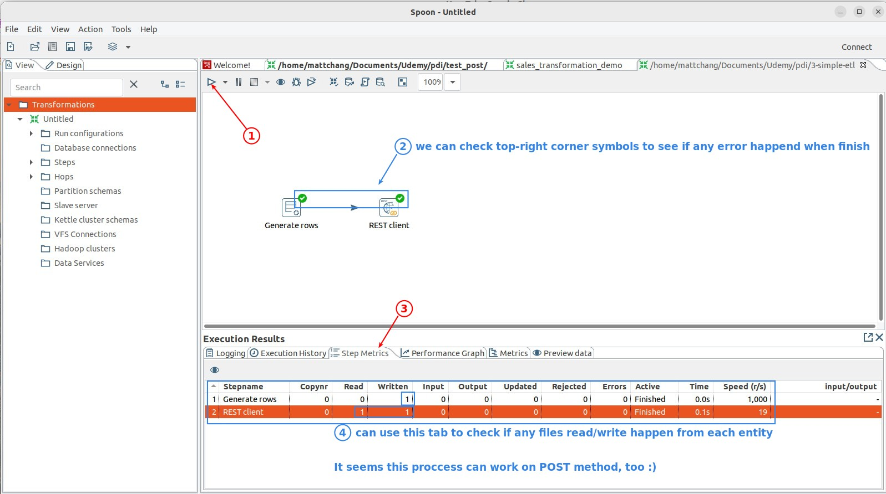

### _Expand process to export JSON file_

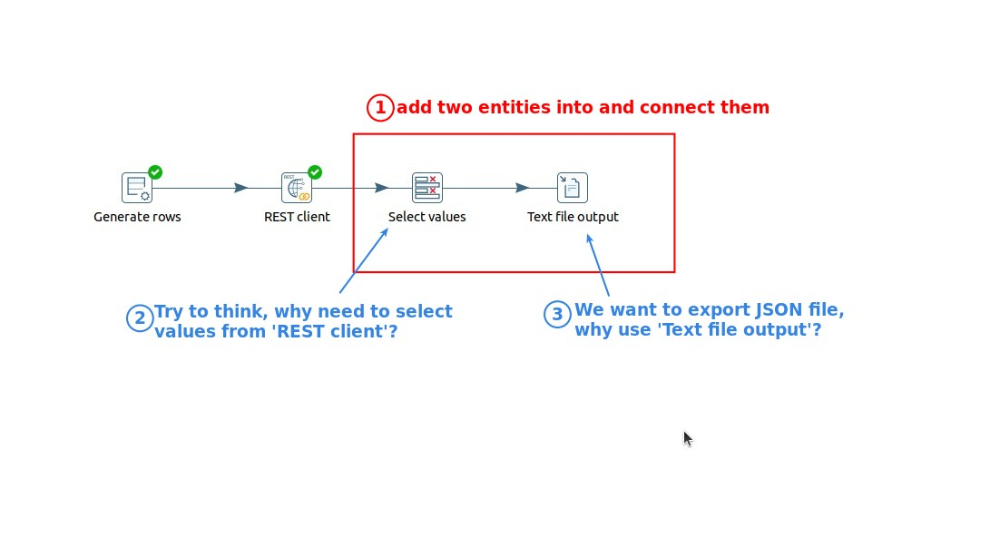

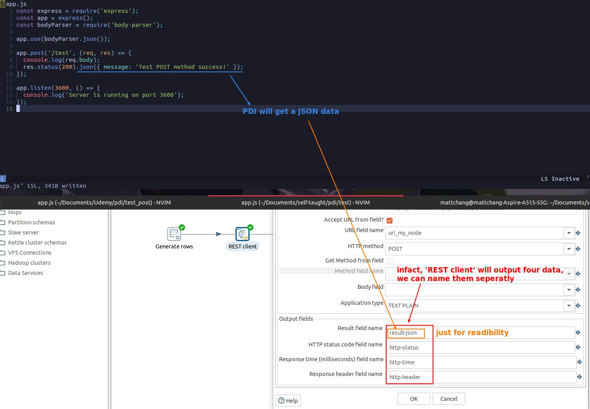

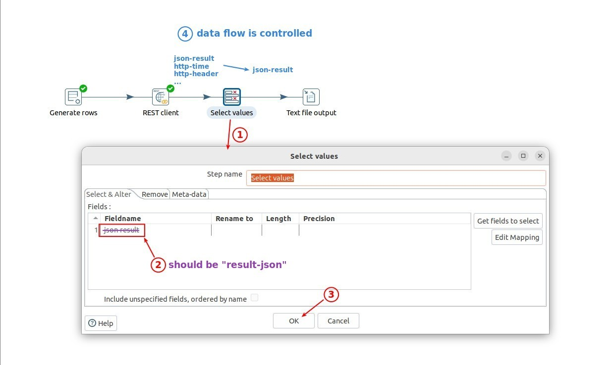

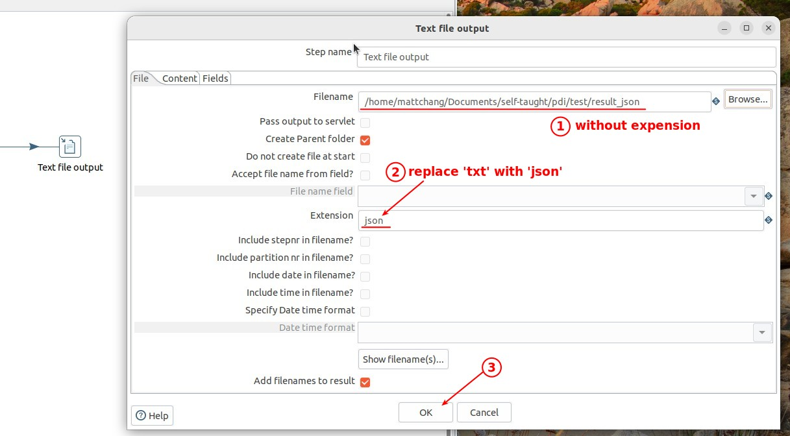

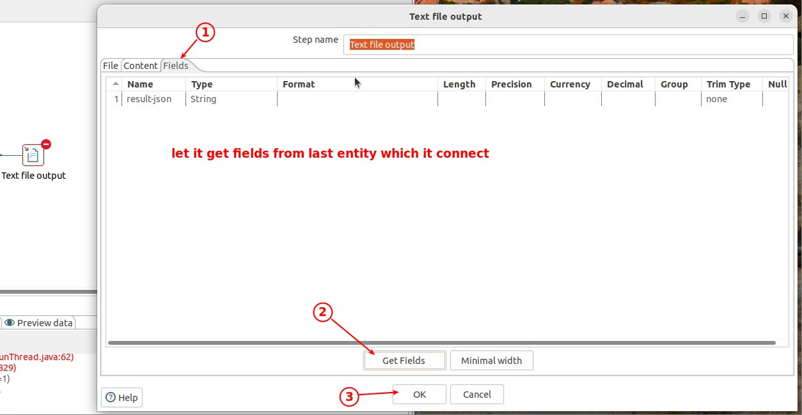

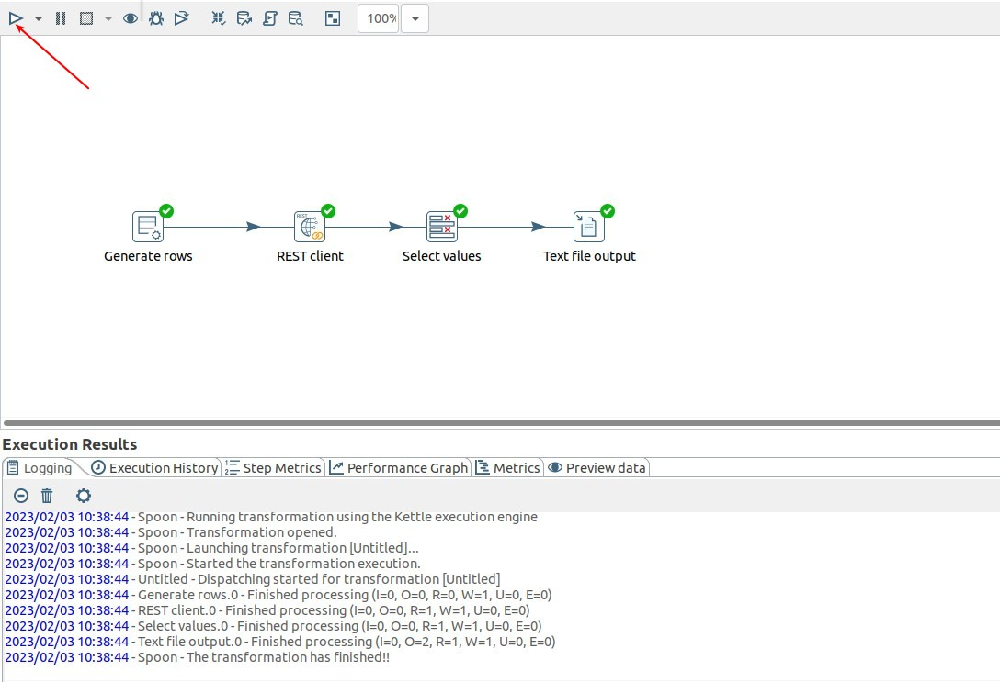

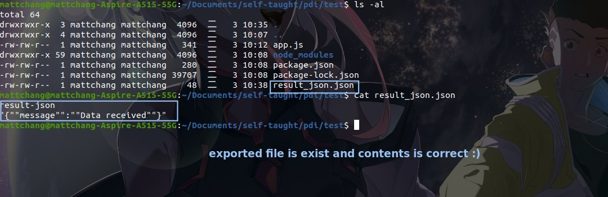
